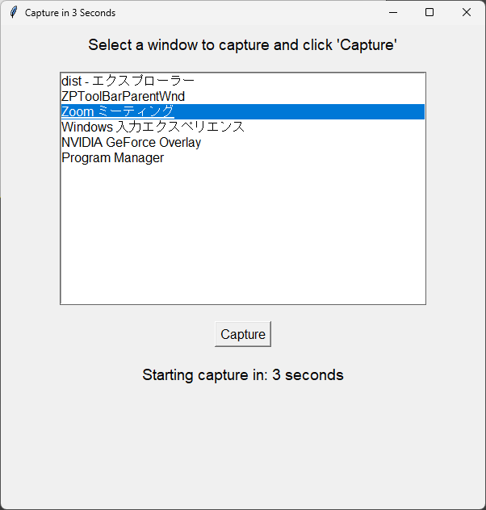
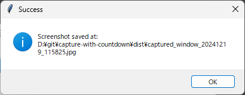

# 3秒後に撮影アプリ

ZOOMで記念キャプチャーを撮るとき、撮影者もポーズが取れるようにしたタイマー付きのキャプチャーアプリです。

動作はWindowsのみです。

## 使い方

「Zoom ミーティング」など、キャプチャーを撮る対象のウィンドウを選択して「Capture」ボタンを押してください。
3秒のカウントダウン後にキャプチャーを撮って画像ファイルとして保存します。

## ダウンロード

こちらからダウンロード

- [capture_with_countdown_0.1.exe](./dist/capture_with_countdown_0.1.exe)

